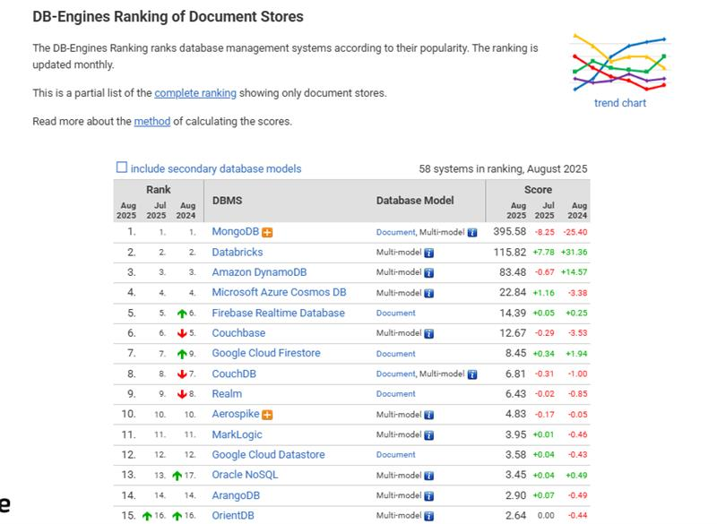

# Bancos NoSQL

É **não somente SQL**, utiliza mecanismos de armazenamento e de recuperação de dados diferentes dos bancos relacionais

- Not only SQL
- Surgiram nos anos 1960

## NoSQL -Estruturas de dados

- Classificação dos tipos de estruturas varia entre os autores, mas há consenso em três delas:

    - Key-value
    - Document
    - Graph

    ### Key-value (chave valor)

    Sistema de armazenamento de dados que usa o conceito **matriz associativa**

    - Um tipo de dados de matriz associativa é um tipo de dado utilizado para representar uma matriz generalizada sem cardinalidade predefinida

    ### Grafo

    - Esrutura utilizada para representar a **relação** entre objetos

    - Formado por **nós** (ou vertices) e **arestas**, com ou sem direção, com ou sem um peso associado

    - Usado para representar itens de dados e suas relações

    Exemplo: Redes sociais

    #### Quando escolher um modelo em grafo

    - Esquema flexivel
    - fortemente baseado em relacionamento 
    - Análise do conjunto de dados inteiro ou em um subconjunto é importante

    ### Banco orientado a documento

    - Sistema de armazenamento de dados em uma forma semi-estruturada: documento

    - O DB extrai os metadados do documento para otimizar as consultas

### Teorema CAP

O teorema CAP (BREWER) dis que você pode somente ter **dois de tres** entre consistencia, tolerancia a partição e disponibilidade

## Bancos NewSQL

- Formas modernas de bancos relacionais

- Usam SQL

