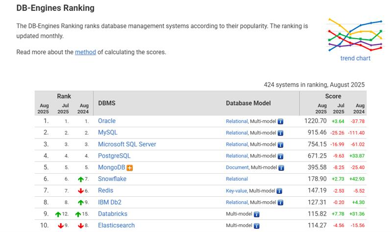

# Big data

## Tipos de dados

O dado é um fato, um valor documentado ou um resultado de medição. Quando um 
sentido semântico ou um significado é atribuído aos dados, gera-se informação.

#### Dados estruturados

- dados que cabem em tabelas

#### Dados semiestrututrados

- Ele não é porque não cabe em um sistema relacional, por exemplo json

#### Dados Desestruturados

- Não existe uma estrutura

### Big data

É gerenciar e armazenar dados de uma forma escalavel, é possivel colocar quantidades quase ilimitadas de dados

## Sistemas de arquivos Distribuidos

É um sistema que pega os dados e espalham para varios lugares

- tolerando a falhas
- trasparencia a dados

    ### Hadoop

    Hadoop distributed file system  
    Sistema de arquivo dis como o dado é e como ele deve ser tratado

    - HDFS é um sistema de arquivos

    Os arquivos são quebrado em boleos e replicados entre os outros sistemas (Isso é um sistema distribuido)

## ACID

ACID é um conceito que se refere às quatro propriedades de transação de um sistema de banco de dados: 

- Atomicidade 
- Consistência
- Isolamento
- Durabilidade.
